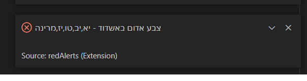

<h1 align="center">
VS Code Red Alerts
</h1>

This extension will display red alerts and play a sound.

## Getting Started

- Add the area you want to get notified about in the settings("redAlerts.area").

## Example

## License
UwU
